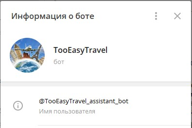
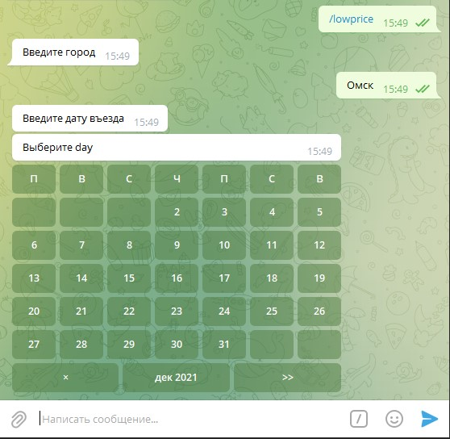
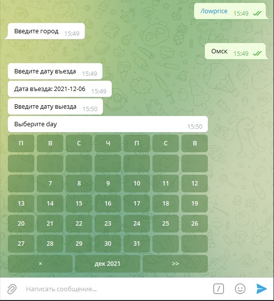
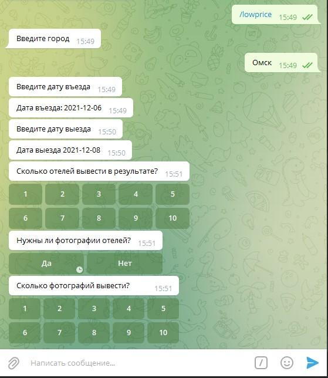
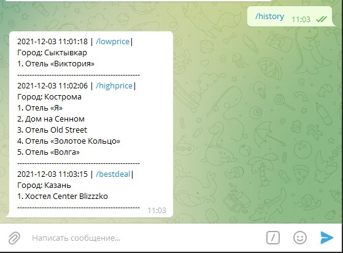

# Telegram-бот для анализа сайта Hotels.com и поиска подходящих пользователю отелей
## [@TooEasyTravel_assistant_bot](https://t.me/TooEasyTravel_assistant_bot) 



###Для работы бота используется открытый API Hotels, который расположен на сайте rapidapi.com.
### API и документации к ним:
[Документация API Hotels](https://rapidapi.com/apidojo/api/hotels4)  
[Документация API Telegram bots](https://core.telegram.org/bots)

*Примечание:  
Убедитесь, что вы действительно заменили токены своими собственными токенами API Hotels и API Telegram bots.*  

````python
# вот тут:
bot = telebot.TeleBot(os.environ['BOT_KEY'])

# и вот тут:
headers: dict = {
    'x-rapidapi-host': "hotels4.p.rapidapi.com",
    'x-rapidapi-key': os.environ['RAPIDAPI_KEY']
}
````
### Библиотеки которые необходимы для работы бота:  *[requirements.txt](requirements.txt)*
## Описание команд бота:
### 1. /lowprice - Узнать топ самых дешёвых отелей в городе
После ввода команды у пользователя запрашивается:
1. Город, где будет проводиться поиск.
2. Дата въезда.
3. Дата выезда.
4. Количество отелей, которые необходимо вывести в результате (не больше 10).
5. Необходимость загрузки и вывода фотографий для каждого отеля (“Да/Нет”)  
    При положительном ответе пользователь также вводит количество необходимых фотографий (не больше 10).

### 2. /highprice - Узнать топ самых дорогих отелей в городе
Команда работает аналогично команде /lowprice.

### 3. /bestdeal - Узнать топ отелей, наиболее подходящих по цене и расположению от центра
После ввода команды у пользователя запрашивается:
1. Город, где будет проводиться поиск.
2. Дата въезда.
3. Дата выезда.
4. Максимальная цена за сутки в рублях.
5. Максимальное расстояние, на котором находится отель от центра города, в километрах.
6. Количество отелей, которые необходимо вывести в результате (не больше 10).
7. Необходимость загрузки и вывода фотографий для каждого отеля (“Да/Нет”)  
   При положительном ответе пользователь также вводит количество необходимых фотографий (не больше 10)

### 4. /history - Узнать историю поиска отелей
После ввода команды пользователю выводится история поиска отелей. Сама история
содержит:
1. Команду, которую вводил пользователь.
2. Дату и время ввода команды.
3. Город.
4. Отели, которые были найдены.

### 5. /clearhistory - Очистить историю поиска
После ввода команды у пользователя запрашивается подтверждение на удаление истории поиска.
Если пользователь подтвердил действие, то история очищается и об этом выводится сообщение.
Если действие не подтверждено, то пользователю выводится список доступных команд.

## Скриншоты:






